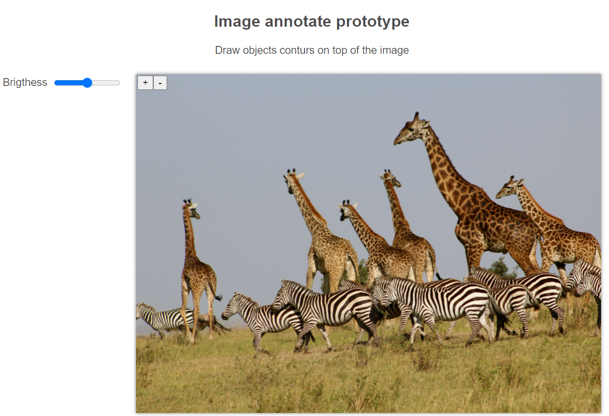

# React Konva

React Konva is a JavaScript library for drawing complex canvas graphics using [React](https://reactjs.org/)

# picture Demo

**Drawing Labels on Image with canvas**

[Documentation](https://konvajs.org/docs/sandbox/Image_Labeling.html)